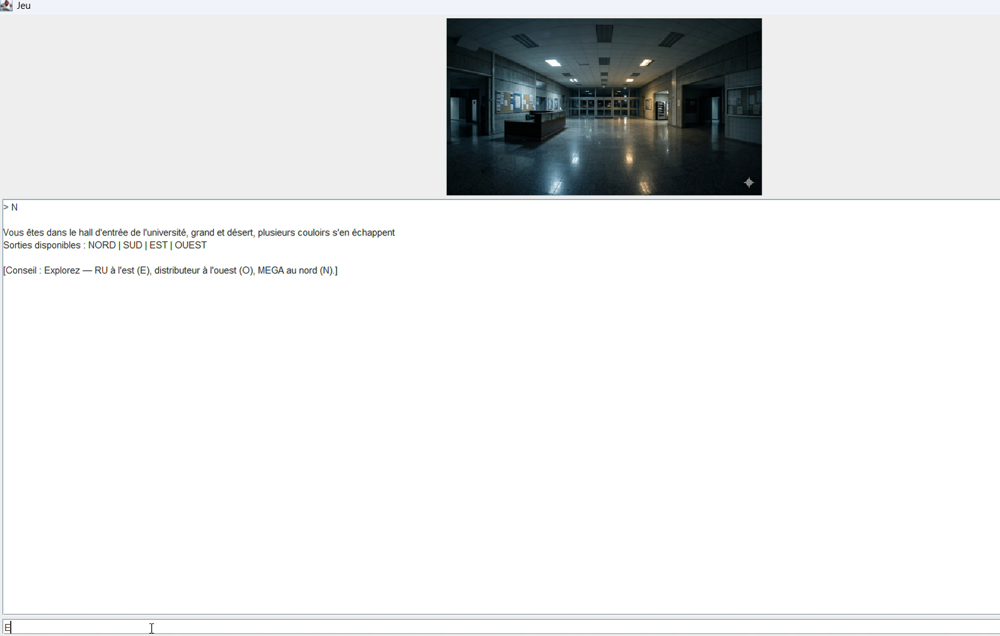
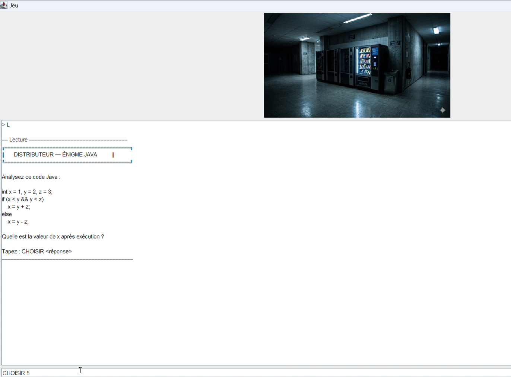
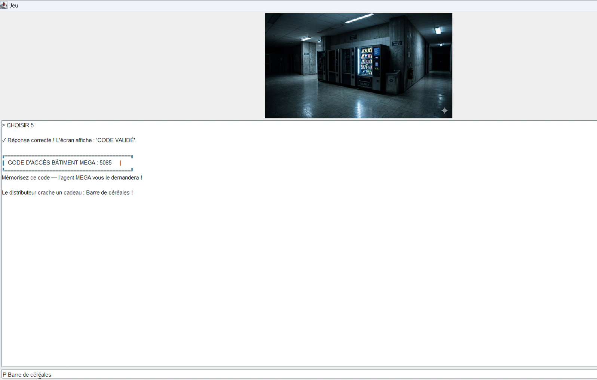
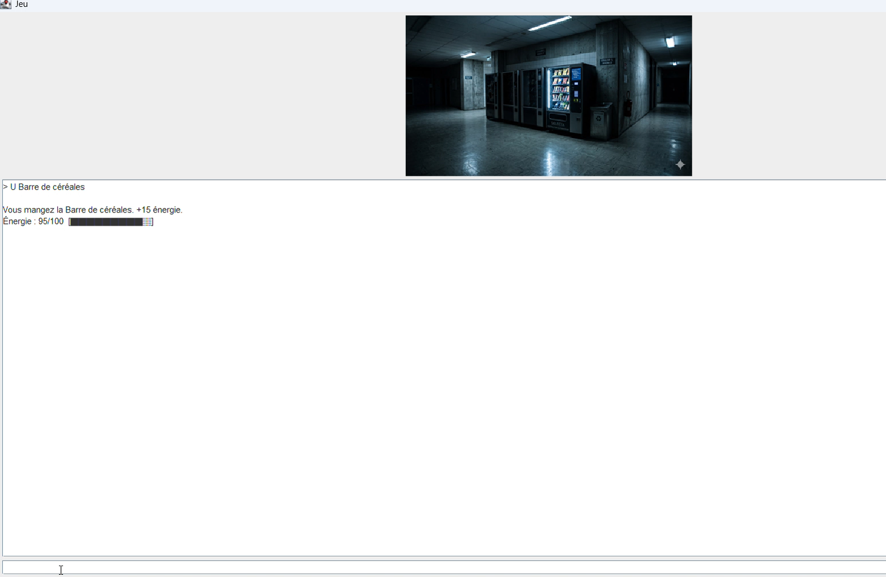
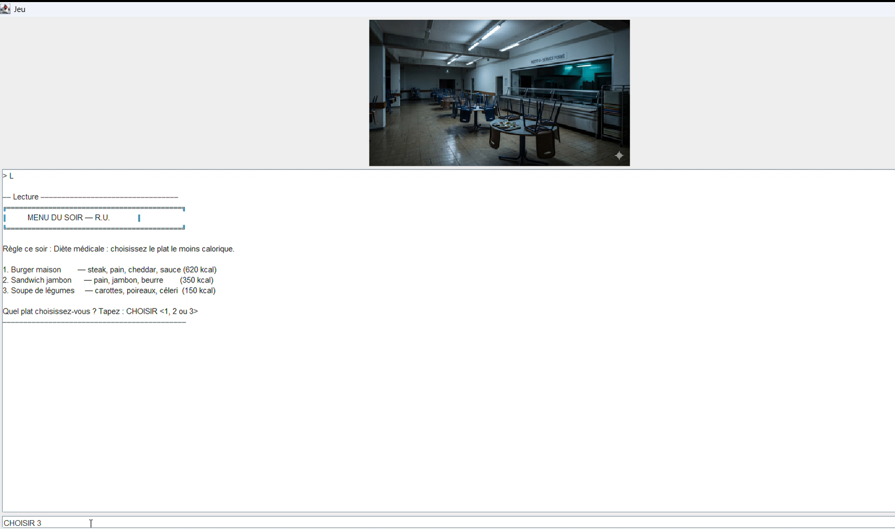
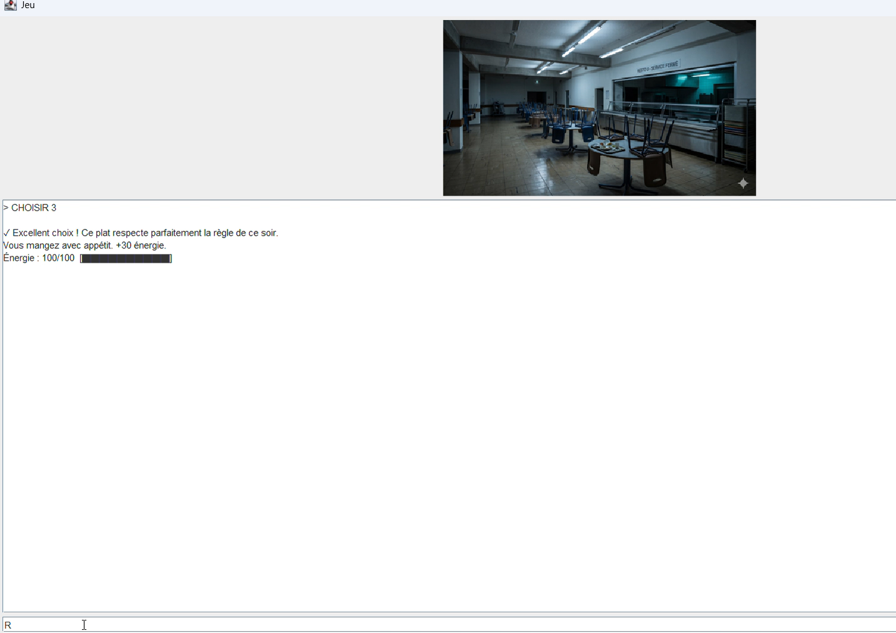
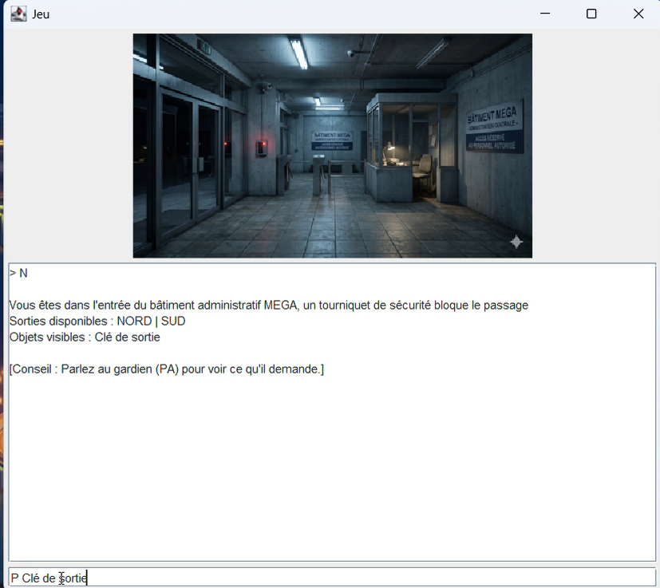
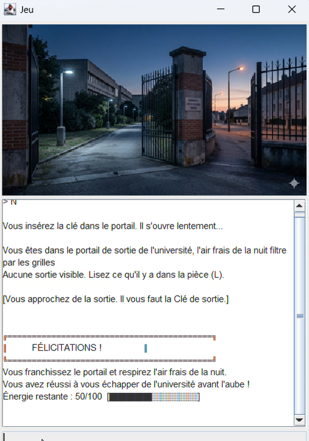

# 🎮 Nuit à la Fac

> Projet de fin d'année – Licence 3 MIAGE (Université d'Aix-Marseille)

---

#  Description

**Nuit à la Fac** est un jeu d'aventure développé en **Java** dans le cadre du projet de fin d'année de Licence 3 MIAGE.

Le joueur incarne un étudiant qui se retrouve enfermé dans son université après s'être endormi en cours. Pour s'échapper avant le lever du jour, il doit explorer les différents bâtiments, résoudre plusieurs énigmes, récupérer des objets, gérer son énergie et interagir avec différents personnages.

Le projet a été développé en utilisant une architecture orientée objet ainsi qu'une interface graphique réalisée avec **Java Swing**.

---

# Fonctionnalités

- Authentification des utilisateurs
- Création et gestion des comptes
- Sauvegarde et chargement des parties
- Gestion de l'inventaire
- Gestion de l'énergie
- Exploration des différents bâtiments
- Résolution de plusieurs énigmes
- Interactions avec des personnages (PNJ)
- Interface graphique Java Swing
- Base de données SQLite
- Tests unitaires avec JUnit

---

#  Technologies utilisées

- Java
- Java Swing
- Maven
- SQLite
- JUnit
- Git
- GitHub

---

#  Ma contribution

Ce projet a été réalisé en équipe de **4 étudiants**.

Au sein de l'équipe, j'ai participé au développement de plusieurs fonctionnalités, notamment :

- Développement du système d'authentification
- Gestion de l'inventaire
- Gestion de l'énergie du joueur
- Développement du système de sauvegarde
- Développement et intégration de nouvelles fonctionnalités
- Réalisation de tests unitaires
- Correction de bugs
- Utilisation de Git et GitHub avec plusieurs branches de développement pour intégrer progressivement les fonctionnalités réalisées

---

#  Aperçu du jeu

##  Hall principal

Le hall principal est l'une des principales zones de l'université. Il permet au joueur d'accéder aux différents bâtiments et de poursuivre son exploration.

---

##  Énigme Java

Le joueur interagit avec un distributeur automatique qui lui propose une énigme portant sur le langage Java. La réussite de cette épreuve permet d'obtenir un code d'accès indispensable pour poursuivre l'aventure.

---

##  Code d'accès obtenu

Après avoir résolu l'énigme, le joueur obtient le code d'accès au bâtiment MEGA ainsi qu'une récompense qui lui sera utile pour la suite de son exploration.

---

##  Récompense : barre de céréales

Le joueur récupère une barre de céréales qui lui permet de restaurer une partie de son énergie.

---

##  Restaurant Universitaire

Le restaurant universitaire propose une nouvelle énigme basée sur le choix du repas le moins calorique. Cette épreuve met à l'épreuve la logique du joueur tout en lui permettant de récupérer de l'énergie.

---

##  Gain d'énergie

Une bonne réponse permet au joueur de récupérer de l'énergie avant de poursuivre son exploration.

---

##  Accès au bâtiment MEGA

Après avoir obtenu le code d'accès, le joueur le présente à l'agent de sécurité. Une fois le code vérifié, l'accès au bâtiment MEGA est autorisé et l'aventure peut se poursuivre.

---

##  Fin de l'aventure

Après avoir résolu les différentes énigmes, exploré les bâtiments de l'université et récupéré les objets nécessaires, le joueur parvient à s'échapper avec succès, marquant la fin de son aventure.

---

# Travail en équipe

Ce projet a été réalisé en collaboration avec trois autres étudiants dans le cadre du projet de fin d'année de Licence 3 MIAGE.

Le dépôt GitHub principal est hébergé sur le compte d'un autre membre de l'équipe, qui assurait la gestion du dépôt collaboratif.

Ce dépôt personnel a pour objectif de présenter le projet ainsi que ma contribution au développement des principales fonctionnalités.

---

# Dépôt GitHub original

Le projet complet est disponible sur le dépôt GitHub du groupe :

➡️ **[Reda-BENMAKDAD / jeu-projet-fin-dannee](https://github.com/Reda-BENMAKDAD/jeu-projet-fin-dannee)**
